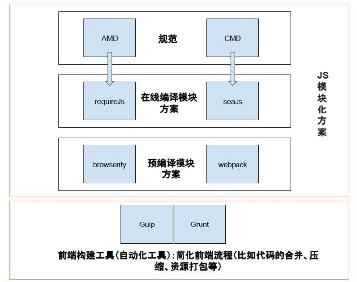

# web-font

**前端工程化模板**

## 1. what I used

##### 前端项目需要的功能：

    1、图片（压缩图片支持jpg、png、gif）
    2、样式 （支持sass 同时支持合并、压缩、重命名）
    3、javascript （检查、合并、压缩、重命名）
    4、html （压缩）
    5、客户端同步刷新显示修改
    6、构建项目前清除发布环境下的文件（保持发布环境的清洁）
    7. 脚手架工具 [Yeoman](http://yeoman.io/)

---

`view        `     ------          `vuejs, bootstrap, jquery`

`包管理工具`------ [bower](https://bower.io/),[npm](https://www.npmjs.com/)

    - browser-sync 能够开启一个静态web服务器，供测试，当源码发生变化时，可以自动刷新页面，不用担心缓存问题
    - 通过gulp plugins，寻找对于的gulp组件
       - gulp-imagemin: 压缩图片
       - gulp-ruby-sass: 支持sass
       - gulp-minify-css: 压缩css
       - gulp-cssnano  CSS压缩  代替minifycss
       - gulp-jshint: 检查js
       - gulp-uglify: 压缩js
       - gulp-concat: 合并文件
       - gulp-rename: 重命名文件
       - gulp-htmlmin: 压缩html
       - gulp-processhtml 对html中的内容进行处理
       - gulp-clean: 清空文件夹
       - gulp-modernizr
       - gulp-autoprefixer
       - gulp-copy-rex
       - gulp-grunt  //add all the gruntfile tasks to gulp
       - gulp-if 提供条件判断
       - gulp-ignore 根据条件忽略部分内容
       - gulp-replace 对指定文件进行内容替换
       - gulp-rimraf 清理目录，用来替代gulp-clean
       - gulp-livereload: 服务器控制客户端同步刷新（需配合chrome插件LiveReload及tiny-lr）(这里选择browser-sync)

`前端构建工具    `------`gulp`

`模块工具选择  `------`webpack`

`单元测试集成  `------`karma + jasmine.`

`版本控制`------`git`

---


#### 1.1 why gulp 「[gulp](https://www.gulpjs.com.cn/)」

Gulp和Grunt的异同点

    易于使用：采用代码优于配置策略，Gulp让简单的事情继续简单，复杂的任务变得可管理。
    高效：通过利用Node.js强大的流，不需要往磁盘写中间文件，可以更快地完成构建。
    高质量：Gulp严格的插件指导方针，确保插件简单并且按你期望的方式工作。
    易于学习：通过把API降到最少，你能在很短的时间内学会Gulp。构建工作就像你设想的一样：是一系列流管道。

`易用` Gulp相比Grunt更简洁，而且遵循代码优于配置策略，维护Gulp更像是写代码。

`高效` Gulp相比Grunt更有设计感，核心设计基于Unix流的概念，通过管道连接，不需要写中间文件。

`高质量` Gulp的每个插件只完成一个功能，这也是Unix的设计原则之一，各个功能通过流进行整合并完成复杂的任务。例如：Grunt的imagemin插件不仅压缩图片，同时还包括缓存功能。他表示，在Gulp中，缓存是另一个插件，可以被别的插件使用，这样就促进了插件的可重用性。目前官方列出的有673个插件。

`易学` Gulp的核心API只有5个，掌握了5个API就学会了Gulp，之后便可以通过管道流组合自己想要的任务。

`流` Gulp是一个基于流的构建系统，使用代码优于配置的策略。
`插件` Gulp的插件更纯粹，单一的功能，并坚持一个插件只做一件事。
`代码优于配置` 维护Gulp更像是写代码，而且Gulp遵循CommonJS规范，因此跟写Node程序没有差别。没有产生中间文件

> 使用Grunt的I/O过程中会产生一些中间态的临时文件，一些任务生成临时文件，其它任务可能会基于临时文件再做处理并生成最终的构建后文件。


Gruntfile.js

    module.exports = function(grunt) {
    grunt.initConfig({
        concat: {
            'dist/all.js': ['src/*.js']
        },
        uglify: {
            'dist/all.min.js': ['dist/all.js']
        },
        jshint: {
            files: ['gruntfile.js', 'src/*.js']
        },
        watch: {
            files: ['gruntfile.js', 'src/*.js'],
            tasks: ['jshint', 'concat', 'uglify']
        }
    });


    // Load Our Plugins
    grunt.loadNpmTasks('grunt-contrib-jshint');
    grunt.loadNpmTasks('grunt-contrib-concat');
    grunt.loadNpmTasks('grunt-contrib-uglify');
    grunt.loadNpmTasks('grunt-contrib-watch');


    // Register Default Task
    grunt.registerTask('default', ['jshint', 'concat', 'uglify']);
    };

> 而使用Gulp的优势就是利用流的方式进行文件的处理，通过管道将多个任务和操作连接起来，因此只有一次I/O的过程，流程更清晰，更纯粹。


Gulpfile.js

    var gulp = require('gulp');
    var jshint = require('gulp-jshint');
    var concat = require('gulp-concat');
    var rename = require('gulp-rename');
    var uglify = require('gulp-uglify');

    // Lint JS
    gulp.task('lint', function() {
    return gulp.src('src/*.js')
        .pipe(jshint())
        .pipe(jshint.reporter('default'));
    });

    // Concat & Minify JS
    gulp.task('minify', function(){
    return gulp.src('src/*.js')
        .pipe(concat('all.js'))
        .pipe(gulp.dest('dist'))
        .pipe(rename('all.min.js'))
        .pipe(uglify())
        .pipe(gulp.dest('dist'));
    });

    // Watch Our Files
    gulp.task('watch', function() {
    gulp.watch('src/*.js', ['lint', 'minify']);
    });

    // Default
    gulp.task('default', ['lint', 'minify', 'watch']);

##### 1.1.0 I/O流程的不同
    使用Grunt的I/O过程中会产生一些中间态的临时文件，一些任务生成临时文件，其它任务可能会基于临时文件再做处理并生成最终的构建后文件。
    而使用Gulp的优势就是利用流的方式进行文件的处理，通过管道将多个任务和操作连接起来，因此只有一次I/O的过程，流程更清晰，更纯粹。

##### 1.1.1 Gulp的核心：流

    Gulp通过流和代码优于配置策略来尽量简化任务编写的工作。这看起来有点“像jQuery”的方法，把动作串起来创建构建任务。早在Unix的初期，流就已经存在了。流在Node.js生态系统中也扮演了重要的角色，类似于*nix将几乎所有设备抽象为文件一样，Node将几乎所有IO操作都抽象成了Stream的操作。因此用Gulp编写任务也可看作是用Node.js编写任务。当使用流时，Gulp去除了中间文件，只将最后的输出写入磁盘，整个过程因此变得更快。

***基于流的模块特点：***

    Write modules that do one thing and do it well.
    Write modules that work together.
    Write modules that handle events and streams.

##### 1.1.2 Depends on

    Liftoff
    Through2
    Vinyl, Vinyl-fs
    Orchestrator

`Liftoff`模块解决的问题是全局安装一个CLI工具，但支持多个项目多个配置文件，并且当前目录没有配置文件时，可以就近向上级目录找到已有的配置文件，或者在项目目录外执行命令行时可以指定配置文件的目录。所以Gulp基于liftoff可以实现，多个项目多个Gulpfile，并且可以执行gulp时指定配置文件路径。

`Through2`是为Node的streams2.Transform的小型封装，来避免subclassing的烦恼。可以更简单的通过一个函数来创建一个流，而不用再繁琐的设置原型链的_transform，_flush，以及再扩充的Transform类中调用构造函数，以便缓冲设定能够正确初始化。

`Vinyl`是用来描述文件的一个非常简单的元信息对象，Vinyl对象有两个主要的属性：path和content。因为一个文件不仅可能是你硬盘上的一些内容，还可能是你托管在S3，FTP，甚至DropBox上的一些内容，所以Vinyl可以描述所有这些来源的文件。它提供了一种简洁的描述文件的方式，但如果你需要访问本地文件系统上的一个文件，还需要通过一个所谓的Vinyl Adapter，它会暴漏一些方法：如.src(globs)，.dest(folder)，和watch(globs, fn)。globs是路径模式匹配。

`Orchestrator`其实是一个基于Node的模块，负责任务依赖关系定义，处理和执行，很像我们目前所用的AMD模块加载器，而且默认是最大限度的并行加载的方式。

事实上，gulp中的任务运行系统并不是自己实现的，而是直接使用了orchestrator。在gulp的源代码中可以发现，gulp继承了orchestrator，而gulp.task仅仅只是orchestrator.add的别名而已：

    //gulp source code
    var util = require('util');
    var Orchestrator = require('orchestrator');

    function Gulp() {
    Orchestrator.call(this);
    }
    util.inherits(Gulp, Orchestrator);

    Gulp.prototype.task = Gulp.prototype.add;

##### 1.1.3 Gulp的API

    gulp.task
    gulp.run
    gulp.watch
    gulp.src
    gulp.dest
    gulp.task

在orchestrator中，解决上述任务依赖的方式有三种：

    在任务定义的function中返回一个数据流，当该数据流的end事件触发时，任务结束。
    在任务定义的function中返回一个promise对象，当该promise对象resolve时，任务结束。
    在任务定义的function中传入callback变量，当callback()执行时，任务结束。

Gulp脚本中可以使用这三种方法来实现任务依赖，不过由于Gulp中的任务大多是数据流操作，因此以第一种方法为主。

#####  1.1.4 Gulp的插件开发

所有的Gulp.js插件基本都是through（后面不再使用transform这个词）streams，即是消费者（接收gulp.src()传递出来的数据，然后进行处理加工处理），又是生产者（将加工后的数据传递出去）。Gulp.js的使用和插件的开发都很简单，当然里面还有很多细节，抛砖引玉，具体请看Gulp.js的官方文档。

#### 1.2 拓展（为什么要使用流）

Node中的I/O操作是异步的，因此磁盘的读写和网络操作都需要传递回调函数。

    ```js
    var http = require('http');
    var fs = require('fs');

    var server = http.createServer(function (req, res) {
            fs.readFile(__dirname + '/data.txt', function (err, data) {
                    res.end(data);
            });
    });
    server.listen(8000);
    ```

这个Node.js应用很简单，估计所有学习过Node的人都做过这样的练习，可以说是Node的Hello World了。这段代码没有任何问题，你使用node可以正常的运行起来，使用浏览器或者其他的http客户端都可以正常的访问运行程序主机的8000端口读取主机上的data.txt文件。但是这种方式隐含了一个潜在的问题，node会把整个data.txt文件都缓存到内存中以便响应客户端的请求（request），随着客户端请求的增加内存的消耗将是非常惊人的，而且客户端需要等待很长传输时间才能得到结果。让我们再看一看另外一种方式，使用流：

    ```js
    var http = require('http');
    var fs = require('fs');

    var server = http.createServer(function (req, res) {
            var stream = fs.createReadStream(__dirname + '/data.txt');
            stream.pipe(res);
    });
    server.listen(8000);
    ```

这里面有一个非常大的变化就是使用createReadStream这个fs的方法创建了stream这个变量，并由这个变量的pip方法来响应客户端的请求。使用stream这个变量就可以让node读取data.txt一定量的时候就开始向客户端发送响应的内容，而无需服务缓存以及客户端的等待。

Node中Stream的种类

    Readable（可读）
    Writeable（可写）
    Duplex（双工）
    Transform（运算双工）

流可以是可读（Readable）或可写（Writable），或者兼具两者（Duplex，双工）的。所有流都是 EventEmitter，但它们也具有其它自定义方法和属性，取决于它们是 Readable、Writable 或 Duplex。

#### 1.3 概念导航

##### 1.3.0 Gulp / Grunt 是一种工具，能够优化前端工作流程。
比如自动刷新页面、combo、压缩css、js、编译less等等。简单来说，就是使用Gulp/Grunt，然后配置你需要的插件，就可以把以前需要手工做的事情让它帮你做了。

##### 1.3.1 `browserify / webpack ， seajs / requirejs `这四个都是JS模块化的方案。

其中`seajs / require` 是一种类型， `browserify / webpack` 是另一种类型。

- seajs / require : 是一种在线"编译" 模块的方案，相当于在页面上加载一个 CMD/AMD 解释器。
这样浏览器就认识了 define、exports、module 这些东西。也就实现了模块化。

- browserify / webpack : 是一个预编译模块的方案，相比于上面 ，这个方案更加智能。
这里以webpack为例。首先，它是预编译的，不需要在浏览器中加载解释器。
另外，你在本地直接写JS，不管是 AMD / CMD / ES6 风格的模块化，它都能认识，并且编译成浏览器认识的JS。

**Gulp是一个工具，而webpack等等是模块化方案。Gulp也可以配置seajs、requirejs甚至webpack的插件。**



## 2. 关于模块化

统一使用的是ES6的模块化语法。也就是import和export。

`cause:` 主要是因为目前公司的新工程都是使用webpack打包。也都支持这种语法。此外个人比较喜欢这种语法。

## 3. 按照功能来分开我们的工具函数

比如说日期相关的工具函数我们都放在date文件夹中，然后统一提供一个index.js来汇总这些工具函数。然后在跟目录的index.js中再汇总各个分类的工具函数。这里要注意的是根目录的index.js的export的写法。

    ```js
    // utils/src/index.js
    // 这种写法是输出一个对象，并不能实现按需加载
    export default {
        module1: module1,
        module2: module2
    }

    // main.js
    // 一旦import就是加载所有，里面的分类只是这个大对象的属性而已
    import utils from 'utils';

    // 即使你这里只用了其中一个模块
    utils.module1();

    // utils/src/index.js
    // 这种写法支持按需加载
    export {
        module1: module1,
        module2: module2
    }

    // main.js
    // 我们只需要引入我们需要的模块就好
    import {module1} from 'utils';

    // 这里只用到了一个模块
    module1();
    ```

## 4. 慎用ES6
虽然在上面的模块化中我们使用了ES6的语法，但是除此之外还是建议不要使用ES6的语法。

`cause:` ES6目前需要babel转码之后才能真正被浏览器运行（虽然少部分浏览器实现了部分ES6的语法）。但是很多时候我们的脚手架（比如我用的vue-cli）在打包的时候并不会去扫描node_moduls文件夹底下的js文件。因为node_moduls里面的文件太多了。这时候如果你的工具代码使用了ES6语法的话，被别的工程引入，打包的时候会报错。

[babel](https://babeljs.cn/docs/setup/)

[es6 with babel or typescript](https://www.zhihu.com/question/34867499)

## 5. typescript 安装 「[github](https://github.com/Microsoft/TypeScript)」

    npm i -g typescript@next  //安装最新的typescript
    tsc --version //查看typescript版本
    npm install tsd -g  //tsd格式的描述信息方便开发工具进行智能提示

    tsd install jquery angular --save //tsd安装范例
    //同时候TSD工具还会为我们在typing目录下生产一个tsd.d.ts文件，它会为我们引入这些模板文件，使得IDE能够识别出这样模板文件：

## 6. 关于systemjs 「[github](https://github.com/systemjs/systemjs)」

systemjs 是一个最小系统加载工具，用来创建插件来处理可替代的场景加载过程，包括加载 CSS 场景和图片，主要运行在浏览器和 NodeJS 中。它是 ES6 浏览器加载程序的的扩展，将应用在本地浏览器中。通常创建的插件名称是模块本身，要是没有特意指定用途，则默认插件名是模块的扩展名称。

    systemjs于commonjs、requirejs等等都是为了实现javascript项目的模块化，也是当前的新技术，所以也把它放在这里，后续angular2等等会用到systemjs。

    `npm install systemjs --save`

## 7. 关于WebStorm

webstorm 10配置TypeScript，在`Languages & Frameworks > TypeScript`中设置 
`command option： -m amd -t ES5`
webstorm 10的版本tsc默认还在1.4，需要手动修改，
建议升级webstorm到最新版本11以上，不然其对typescript和angular的支持始终比较蛋疼


# important(相关细节请至原博客查看，此文仅限于个人理解加相关知识点整理)

[参考博客](http://blog.csdn.net/chaos_hf/article/details/78735335) ～ chaos_hf ～

[参考博客](http://blog.csdn.net/vuturn/article/details/52125938)   ~  vuturn ~

[参考博客](http://blog.csdn.net/cz_jjq/article/details/50425206)   ~  cz_jjq的专栏 ~

